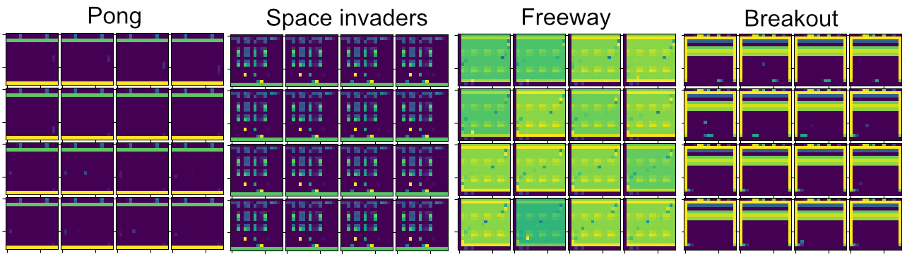

# Arcade prediction environment 

The files for environments can be downloaded from [Google drive link](https://drive.google.com/drive/folders/19AwuhsZdFUpyb-kHxAIzaYewCqF1pPxw?usp=sharing). Each environment contains 200k+ steps of interactions of a pre-trained rainbow DQN agent. The repository provides the python dataloader. 

Environments down-scaled to 16 x 16. Looking at a single frame, it's hard to figure out information information about the environment. For instance in Pong, the ball is often not visible in a single frame. However, looking at the sequence of frames, we can tell the position and the direction of the ball. This partial observability due to down-scaling makes 16 x 16 Atari an interesting benchmark for studying state construction.
